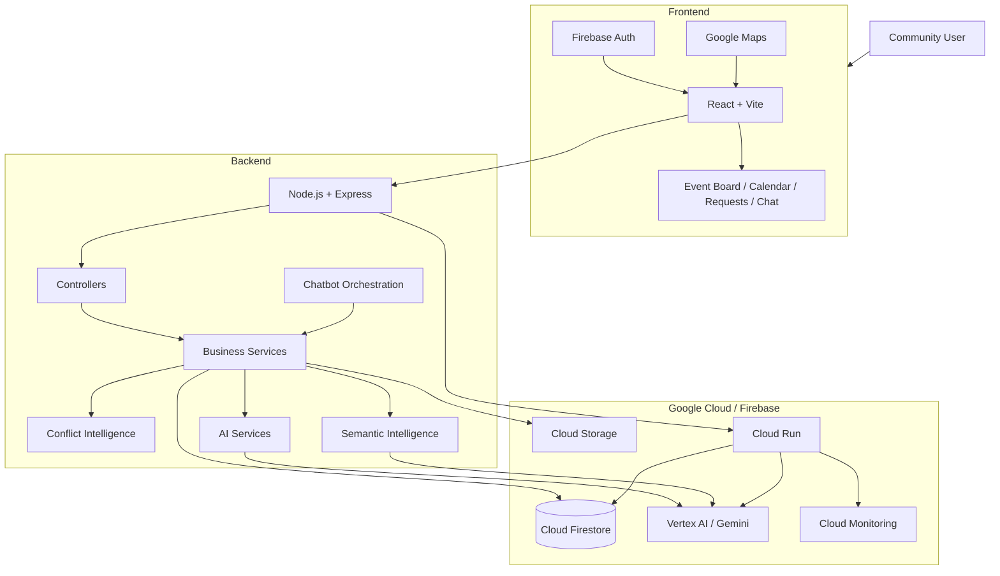

<div align="center">

# EventHive
### Local Event Bulletin Board

<p>A smart hyperlocal event coordination platform for discovering, creating, and organizing community events.</p>

<p>
<a href="https://eventhive.web.app"><strong>Live Application</strong></a>
&nbsp;·&nbsp;
<a href="https://github.com/VishnuBharathi11/local-event-bulletin-board"><strong>Source Code</strong></a>
</p>

<p>


</p>

</div>

---

## Overview

**EventHive** is a hyperlocal event coordination platform that brings fragmented local event information into one searchable community bulletin board.

Community members can discover upcoming events, create events, search and filter by location and category, view events on maps and calendars, RSVP, share events, create community requests, express interest, and benefit from intelligent conflict and semantic analysis.

The project was developed as a **Cognizant Hackathon 2026** solution.

---

## Problem

Local event information is commonly distributed across social-media posts, messaging groups, posters, and word of mouth. This creates four recurring problems:

| Problem | Impact |
|---|---|
| Fragmented information | Events are difficult to discover in one place. |
| Low visibility | Small community events can be lost among unrelated content. |
| Scheduling conflicts | Similar events may compete for the same time, location, or audience. |
| Unknown demand | Organizers have little structured information about what the community wants. |

---

## Solution

EventHive combines an event bulletin board with demand-driven community coordination and intelligent analysis.

<div align="center">

**Discover → Create → Coordinate → Understand Demand → Avoid Conflicts**

</div>

### Core workflow

1. Discover local events.
2. Search, filter, and sort events.
3. Open event details and view the location.
4. RSVP using the **I'm Going** counter.
5. Create events through a multi-step form.
6. Detect potential event conflicts.
7. Create Community Requests for events that do not yet exist.
8. Let other users express interest.
9. Use semantic and conversational intelligence to explore event information.

---

## Features

### Event Discovery

- Search by event information
- Category filtering
- Date filtering
- City and neighborhood filtering
- Date-based sorting
- Event status and expiration handling
- Responsive event cards
- Event detail pages
- Google Maps integration

### Event Creation

- Multi-step creation workflow
- Basic information
- Date and time
- Location search
- Map-based location support
- Description and category
- Review before publishing
- Organizer ownership

### Coordination

- **I'm Going** RSVP counter
- Calendar view
- Shareable event links
- Event expiration
- Location visualization
- Authentication-protected actions

### Community Requests

Community Requests allow users to express demand for events before they exist.

Users can:

- Create an event request
- Generate or improve request descriptions with AI assistance
- Specify date, time, and location requirements
- Express interest
- Remove interest
- View community demand
- Edit requests they own

### Conflict Intelligence

EventHive evaluates multiple signals instead of relying only on title matching.

Signals include:

- City similarity
- Neighborhood similarity
- Specific location similarity
- Time overlap
- Category similarity
- Title similarity

The deterministic conflict threshold is:

```text
CONFLICT_THRESHOLD = 70
```

A hard scheduling conflict is detected when the same specific venue has overlapping event times, regardless of category or title similarity.

### Semantic Intelligence

The backend contains services for:

- Semantic event similarity
- Activity-domain similarity
- Semantic event discovery
- Semantic conflict analysis
- Semantic trend clustering
- Event embeddings
- Embedding validation and backfill

### Conversational Assistant

The chatbot architecture includes:

- Capability discovery
- Upcoming-event lookup
- Event detail lookup
- Community-demand lookup
- Deterministic trend intelligence
- Conversation context
- Orchestration
- Conversational hardening
- Gemini integration

The architecture keeps deterministic business rules separate from AI-assisted functionality.

---

## Architecture



---

## Technology Stack

| Layer | Technology | Purpose |
|---|---|---|
| Frontend | React + Vite | Web application |
| Backend | Node.js + Express | REST API and business logic |
| Authentication | Firebase Authentication | User identity |
| Database | Cloud Firestore | Application persistence |
| Maps | Google Maps Platform | Location search and visualization |
| AI | Vertex AI / Gemini | AI-assisted functionality |
| Semantic Layer | Embeddings + vector-search infrastructure | Similarity and discovery |
| Storage | Cloud Storage | Assets and files |
| Backend Deployment | Cloud Run | Containerized API |
| Frontend Hosting | Firebase Hosting | Web hosting |
| Monitoring | Google Cloud Monitoring | Observability |
| Testing | Node.js Test Runner | Automated tests |

---

## Application Architecture

```text
Browser
   │
   ▼
React + Vite
   │
   ▼
Express REST API
   │
   ├── Controllers
   │      └── Services
   │             ├── Event Services
   │             ├── RSVP Services
   │             ├── Community Request Services
   │             ├── Conflict Intelligence
   │             ├── Semantic Intelligence
   │             ├── Trend Intelligence
   │             └── Chatbot Orchestration
   │
   ├──────────────► Cloud Firestore
   ├──────────────► Vertex AI / Gemini
   ├──────────────► Cloud Storage
   └──────────────► Google Maps services
```

---

## Repository Structure

```text
local-event-bulletin-board/
│
├── backend/
│   ├── docs/
│   ├── src/
│   │   ├── config/
│   │   ├── controllers/
│   │   ├── middleware/
│   │   ├── models/
│   │   ├── repositories/
│   │   ├── routes/
│   │   ├── scripts/
│   │   └── services/
│   └── test/
│
├── docs/
│
├── frontend/
│   ├── public/
│   ├── src/
│   │   ├── assets/
│   │   ├── components/
│   │   ├── context/
│   │   ├── hooks/
│   │   ├── layouts/
│   │   ├── navigation/
│   │   ├── pages/
│   │   ├── services/
│   │   ├── state/
│   │   ├── styles/
│   │   └── utils/
│   └── test/
│
├── cloudbuild.yaml
├── firebase.json
├── firestore.indexes.json
├── firestore.rules
├── package.json
└── README.md
```

---

## Data Model

Primary Firestore collections:

| Collection | Purpose |
|---|---|
| `events` | Published events |
| `eventRequests` | Community event requests |
| `eventRSVPs` | RSVP records |
| `eventRequestInterest` | Interest in community requests |
| `eventConflicts` | Detected conflicts |
| `registrations` | Registration information |
| `users` | User information |

A typical event contains:

```text
eventId
title
description
category
city
neighborhood
location
district
startTime
endTime
status
rsvpCount
organizerId
createdAt
expireAt
conflictStatus
imageUrl
latitude
longitude
```

---

## Conflict Detection Model

### Deterministic scoring

```text
Same city              → 15
Same neighborhood      → 10
Same specific location →  5
Time overlap            → 30
Same category           → 20
Title similarity        → up to 20
```

Potential conflicts are evaluated against the configured threshold.

### Hard scheduling rule

```text
Same specific venue
        +
Overlapping time
        =
Hard scheduling conflict
```

This protects against direct venue-time collisions even when two events have unrelated titles.

### Semantic layer

Semantic similarity extends deterministic detection by recognizing related activities whose wording may be different.

---

## Community Demand

Community Requests introduce a demand-driven workflow:

```text
User wants an event
        │
        ▼
Create Community Request
        │
        ▼
Other users express interest
        │
        ▼
Demand accumulates
        │
        ▼
Community / organizer understands demand
```

This changes the platform from simply listing existing events to also capturing unmet community demand.

---

## AI and Semantic Architecture

```text
                ┌──────────────────┐
                │   EventHive UI   │
                └────────┬─────────┘
                         │
                         ▼
                ┌──────────────────┐
                │ Express Backend  │
                └────────┬─────────┘
                         │
          ┌──────────────┼──────────────┐
          ▼              ▼              ▼
   Deterministic      Semantic       Chatbot
   Intelligence       Services      Orchestration
          │              │              │
          │              ▼              │
          │        Embeddings           │
          │              │              │
          └──────────────┼──────────────┘
                         ▼
                ┌──────────────────┐
                │ Vertex AI/Gemini│
                └──────────────────┘
```

AI is used as an assistance and intelligence layer while deterministic application logic remains responsible for predictable business rules.

---

## Google Cloud Architecture

| Service | Role |
|---|---|
| Firebase Authentication | Authentication |
| Cloud Firestore | Database |
| Firebase Hosting | Frontend hosting |
| Cloud Run | Backend deployment |
| Vertex AI | AI and semantic capabilities |
| Cloud Storage | File and asset storage |
| Google Maps Platform | Maps and location |
| Cloud Monitoring | Monitoring |

Production flow:

```text
User Browser
     │
     ├────────► Firebase Hosting
     │              │
     │              ▼
     │          React App
     │              │
     │              ▼
     │         Cloud Run API
     │              │
     │        ┌─────┼─────┐
     │        ▼     ▼     ▼
     │   Firestore Vertex Storage
     │             AI
     │
     └────────► Google Maps
```

---

## Live Application

<div align="center">

<a href="https://eventhive.web.app">
  <strong>EventHive — Live Application</strong>
</a>

<br><br>

<a href="https://local-event-backend-33286237488.asia-south1.run.app">
  <strong>Backend — Cloud Run</strong>
</a>

<br><br>

<a href="https://github.com/VishnuBharathi11/local-event-bulletin-board">
  <strong>GitHub Repository</strong>
</a>

</div>

---

## API Structure

| Area | Route |
|---|---|
| Health | `/api/health` |
| Authentication | `/api/auth/*` |
| Events | `/api/events/*` |
| Event Requests | `/api/event-requests/*` |
| RSVP | `/api/rsvp/*` |
| AI | `/api/ai/*` |
| Chatbot | `/api/chatbot/*` |
| Location | `/api/location/*` |

The chatbot foundation includes capabilities and application-data tools for upcoming events, event details, and community demand.

---

## Testing

Run backend tests:

```bash
node --test backend/test/*.test.js
```

Run frontend tests:

```bash
node --test frontend/test/*.test.js
```

Build the production frontend:

```bash
cd frontend
npm run build
```

Validated implementation:

```text
Backend tests       → 76 passing
Frontend tests      → 25 passing
Production build    → successful
```

---

## Environment Configuration

Environment templates are provided at:

```text
backend/.env.example
frontend/.env.example
```

Configure environment-specific values for:

- Firebase
- Google Maps
- Google Cloud
- Vertex AI
- Backend API endpoints

Do not commit private keys, service-account credentials, or other secrets.

---

## Security

The application uses:

- Firebase Authentication
- Protected backend routes
- Owner-only modification of owned resources
- Server-side business logic
- Environment-based secrets
- Restricted Google API keys
- Separation of public client configuration from backend credentials

---

## Deployment

### Frontend

Build:

```bash
cd frontend
npm install
npm run build
```

Deploy through the configured Firebase Hosting workflow.

### Backend

Install dependencies:

```bash
cd backend
npm install
```

The backend is containerized with the provided `Dockerfile` and deployed to Google Cloud Run.

---

## Project Evolution

```text
Initial Prototype
       │
       ▼
Event Board
       │
       ▼
Event Creation + RSVP
       │
       ▼
Community Requests
       │
       ▼
Deterministic Conflict Detection
       │
       ▼
Chatbot Foundation
       │
       ▼
Trend Intelligence
       │
       ▼
Semantic Intelligence
       │
       ▼
AI-Assisted Event Creation
       │
       ▼
Integrated Web Application
```

The current `main` branch is the web-first implementation. The legacy Android/Kotlin implementation has been removed from the current source tree.

---

## Hackathon Innovation

### Demand-driven coordination

Community Requests capture demand before an event exists.

### Multi-signal conflict detection

Conflict analysis combines time, location, category, city, neighborhood, and title signals.

### Hard scheduling protection

Same-venue overlapping events are treated as hard conflicts.

### Semantic intelligence

Embedding-based services support similarity, discovery, conflict analysis, and trend clustering.

### Explainable architecture

Deterministic metrics provide predictable behavior while AI is used for assistance and explanation.

### Conversational access

The chatbot provides a natural-language interface over EventHive capabilities and event intelligence.

---

## Demo Flow

```text
01  Open EventHive
02  Discover events
03  Search and filter
04  Open event details
05  View map / calendar
06  Create an event
07  Demonstrate conflict intelligence
08  Create a Community Request
09  Demonstrate community interest
10  Demonstrate conversational intelligence
```

---

## Team Architecture

The project uses responsibility-based ownership across:

- Solution Architecture & Overall Integration
- Event Discovery & Experience
- Event Creation & Workflow
- Event Data & Lifecycle
- Community Requests & Demand
- AI & Semantic Intelligence
- Conversational Intelligence
- Discovery & Sharing

---

## Project Status

<div align="center">

**Integrated Web Application**

The current `main` branch contains the cleaned EventHive web implementation with React, Node.js/Express, Firebase, Google Cloud, AI, semantic intelligence, and automated tests.

</div>

---

## License

This repository was developed as a hackathon project.

If an open-source license is added later, this section should be updated accordingly.

---

<div align="center">

## EventHive

**Discover local events. Create community experiences. Coordinate intelligently.**

<br>

<a href="https://eventhive.web.app">Live Application</a>
&nbsp;·&nbsp;
<a href="https://github.com/VishnuBharathi11/local-event-bulletin-board">GitHub</a>

</div>
